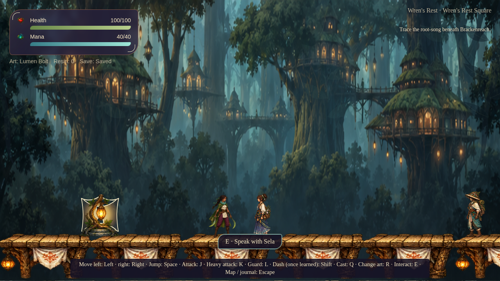
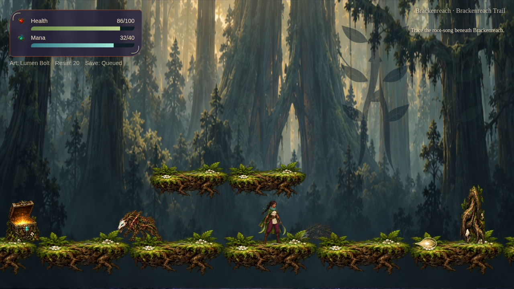
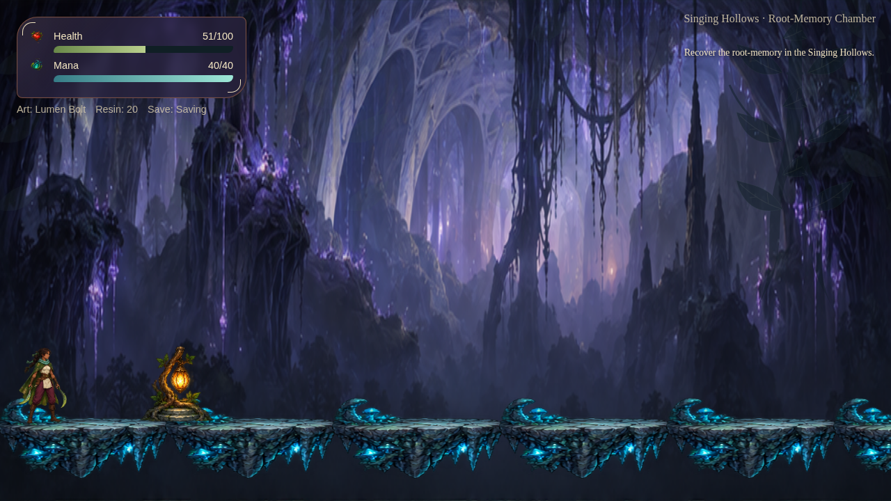
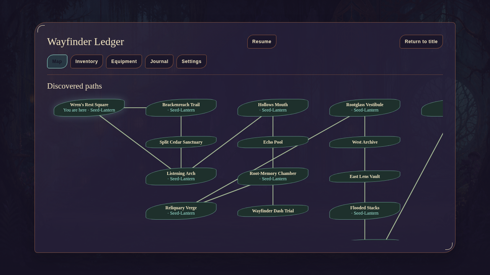

# Rivenbloom

Explore a valley of living roots, forgotten paths, and luminous glass as **Mara Vey**.
Rivenbloom is an original side-view fantasy action-adventure: jump across woodland
platforms, fight with a crescent blade, learn magical arts, and restore the root-song.



_Your journey begins in Wren's Rest. Follow the objective at the top right and the interaction prompt at the bottom._

[Start playing](#start-playing) · [Controls](#controls) · [Combat and magic](#combat-and-magic) ·
[Exploration and progression](#exploration-and-progression) · [Saves](#saving-and-continuing)

## Start playing

Use a desktop browser with a keyboard or gamepad. To run the current browser build
locally, install [Node.js](https://nodejs.org/) (24.x recommended), then:

```bash
git clone https://github.com/ClarenceChoo/Rivenbloom.git
cd Rivenbloom
npm install
npm run dev
```

Open the local URL printed by Vite. Leave that terminal running while you play.

1. On the title screen, choose **Begin journey** on an empty Journey card, then
   confirm **Begin journey**. There are three independent save slots.
2. Choose **Enter Wren's Rest** to start.
3. Stand beside the glowing Seed-Lantern and press **E** when the **Rest** prompt
   appears. Resting refills health and mana and sets your return point.
4. Walk right to **Sela Quill**, press **E** to talk, and choose **I will listen.**
   This begins **The Silent Bloom**, the main quest.
5. Continue east into **Brackenreach**. Follow the objective in the HUD; press
   **Escape** and open **Journal** whenever you need a reminder.

To resume later, open the same browser and game address, then choose **Continue**
on your Journey card.

## Controls

These are the default bindings. Gamepad names below use Xbox / PlayStation labels
for the common button layout.

| Action                               | Keyboard                             | Common gamepad                           |
| ------------------------------------ | ------------------------------------ | ---------------------------------------- |
| Move left / right                    | Left / Right arrows or A / D         | Left stick / D-pad                       |
| Climb up / down                      | Up / Down arrows or W / S            | Left stick / D-pad up / down             |
| Jump                                 | Space                                | A / Cross (south)                        |
| Light attack                         | J                                    | X / Square (west)                        |
| Heavy attack / charge                | K; hold to charge, release to strike | Y / Triangle (north); hold, then release |
| Block / parry                        | L                                    | LB / L1                                  |
| Wayfinder Dash, once learned         | Left Shift                           | B / Circle (east)                        |
| Cast selected art                    | Q                                    | RT / R2                                  |
| Cycle magical art                    | R                                    | LT / L2                                  |
| Talk, open, rest, or use a mechanism | E                                    | RB / R1                                  |
| Pause / open the Wayfinder Ledger    | Escape                               | Menu / Options                           |
| Navigate menus                       | Arrow keys or WASD                   | Left stick / D-pad                       |
| Confirm a menu choice                | Enter or Space                       | A / Cross                                |
| Cancel / close a menu                | Escape or Backspace                  | B / Circle                               |

Hold **Up** near a ladder to catch it and climb. Look for the **Up** prompt when
a ladder is in reach.

Change keyboard gameplay bindings in **Escape → Settings → Keyboard bindings**.
The HUD prompts follow your bindings. Settings and bindings are saved separately
for each journey.

## Combat and magic



_Watch enemy windups, keep an eye on health and mana, and make space before attacking._

- **Light attacks:** tap **J** to strike; successive well-timed taps chain a combo.
  You can also attack in the air.
- **Charged heavy attacks:** hold **K** for about half a second, then release.
  Use these against tougher enemies and breakable root barriers.
- **Guard and parry:** face the attack and hold **L** to guard. Start your guard
  just before a hit lands to parry it. Watch for enemy tells before committing
  to an attack.
- **Dash:** once you learn Wayfinder Dash, press **Left Shift** to move quickly
  in the direction you face, with a brief window of protection. It costs no mana
  and has its own cooldown.
- **Magic:** press **R** to select an unlocked art, then **Q** to cast. The HUD
  shows your selected **Art**. Spells need mana and time to recharge.

| Magical art        | What it does                                                          |
| ------------------ | --------------------------------------------------------------------- |
| **Lumen Bolt**     | Your starting ranged attack. Fires in the direction you face.         |
| **Aegis Veil**     | A temporary protective barrier that can absorb a projectile.          |
| **Resonant Pulse** | A short-range wave that also awakens compatible rootglass mechanisms. |

You learn additional arts as the journey progresses. Dash uses its own button
rather than the spell-cycling controls.

**Recover before the next fight.** Rest at Seed-Lanterns for full health and mana.
Piri's herb stall sells **Sunmoss Draughts** (30 health) and **Wellspring Tonics**
(20 mana). To drink one, open **Escape → Inventory** and choose **Use** beside it.
Each recovery item can be carried in a stack of up to five.

## Exploration and progression

The playable adventure crosses five areas:

**Wren's Rest → Brackenreach → Singing Hollows → Rootglass Reliquary → Hollow Choir**



_Seed-Lanterns offer a place to recover as you explore the Singing Hollows._

Look for chests, memorial lanterns, optional paths, and shortcuts. **Resin** is
your currency for remedies, charms, and Orin's weapon reforge. Some routes open
only after a quest, puzzle, or upgrade, so returning to an earlier area is part
of the journey.

The main quest is **The Silent Bloom**. **The Lost Folio** and
**Lanterns for the Absent** are optional quests. Hidden discoveries can also
increase your maximum health or mana.

### Use the Wayfinder Ledger

Press **Escape** to pause and open the Ledger. Choose **Resume** to return to play.

| Tab           | Use it to…                                                                          |
| ------------- | ----------------------------------------------------------------------------------- |
| **Map**       | See discovered rooms, connections, Seed-Lanterns, and known quest destinations.     |
| **Inventory** | Read item descriptions and use recovery items.                                      |
| **Equipment** | Equip or remove charms in your three charm slots. Owning a charm does not equip it. |
| **Journal**   | Read the current stage and objective of each quest.                                 |
| **Settings**  | Change difficulty, controls, accessibility, and audio.                              |



_The map grows as you explore. Scroll inside it to see rooms beyond the visible portion._

Solid connections are open; dashed connections are locked. Undiscovered rooms
appear when you find them, and a quest marker appears only after its room has
been discovered. The map shows connections rather than a platform-by-platform
layout.

### Hints when a path is blocked

Try the interaction shown in the HUD, read **Journal**, and check whether a new
art or weapon upgrade could help. Dash is earned in the Singing Hollows; pressing
Shift before you learn it will not dash.

<details>
<summary>Show progression and puzzle hints (spoilers)</summary>

1. **The Listening Arch:** follow Sela's trail through Brackenreach into the
   Singing Hollows. Recover the root-memory and bring it back to **Piri**.
   The opened homeward shortcut makes returning to the village easier.
2. **Wayfinder Dash:** find the trial beneath the Root-Memory Chamber. Climb into
   position before starting the timed circuit, then touch all three dew plates
   before the root-song fades. You earn Dash by completing the trial.
3. **Orin's reforge:** defeat the Thorn Sentinel beyond the chamber for a
   **Briar Core**, then bring it and **50 Resin** to Orin in Wren's Rest.
4. **The Reliquary:** recover the **Rootglass Index Key** in the West Archive and
   use it at the Vestibule's Index Seal. After Orin's reforge, awaken the
   **Rootglass Forge** to strengthen your blade and learn **Resonant Pulse**.
5. **Threefold Lens:** turn the eastern dials in the order **root → rain → bloom**.
6. **Choir Seal:** answer **memory → breath → song**. Use Resonant Pulse at the
   first two lenses, waiting for its cooldown between casts, then interact with
   the song lens.
7. **The Hollow Choir:** use what you learned about Resonant Pulse to awaken both
   resonators when the Cantor's heart is protected. Attack when the heart is exposed.
8. Follow the final Journal objective back to **Sela** to finish the main quest.

</details>

## Difficulty, comfort, and accessibility

Open **Escape → Settings**, make your changes, and choose **Apply settings**.

- **Story** reduces incoming damage to 75%; **Standard** uses 100%;
  **Challenging** uses 125%. Rewards and puzzles stay the same.
- Adjust reduced motion, camera shake, flashes, subtitles, text size,
  high-contrast prompts, and damage numbers.
- Choose hold or toggle behavior for sustained actions.
- Set music, effects, ambience, and master volume separately, or mute the game
  while its window is unfocused.

Keyboard play has been checked in desktop Chromium. Physical gamepads and
Safari/Firefox still need qualification. Phone touch controls are not available;
use a desktop window for gameplay.

## Saving and continuing

The game autosaves your journey. Watch the HUD's **Save** status and wait for
**Saved** before closing the tab. Use **Escape → Return to title** when you are
finished playing.

Seed-Lanterns set your return point and restore health and mana. If Mara falls,
you return to the current checkpoint; persistent quest progress, opened chests,
solved puzzles, and earned upgrades remain. Ordinary enemies can return after
resting or restoring the world.

Your three journeys are stored in **this browser profile at this game address**.
They do not sync between browsers or devices. From the title screen, use
**Export** to keep a backup and **Import** to preview and restore one. Export
before clearing browser data or changing the game's address. If storage is
unavailable, the game reports a save failure or session-only storage.

**Offline play:** the production browser build can be installed through a
supporting browser and reopened offline after its first complete online load.
This applies to the built game, rather than the development server. When an
update is ready, the visible reload button saves your journey before restarting.

## Development and credits

For production builds, desktop packaging, hosting, architecture, and test commands,
see the [developer guide](docs/development.md).
Current verification limits are listed in [known issues](docs/known-issues.md).

The world, characters, visuals, and audio are original to Rivenbloom.
[Asset provenance and screenshot sources](docs/asset-provenance.md) document their
authorship. The images in this guide are unedited screenshots of the game.
